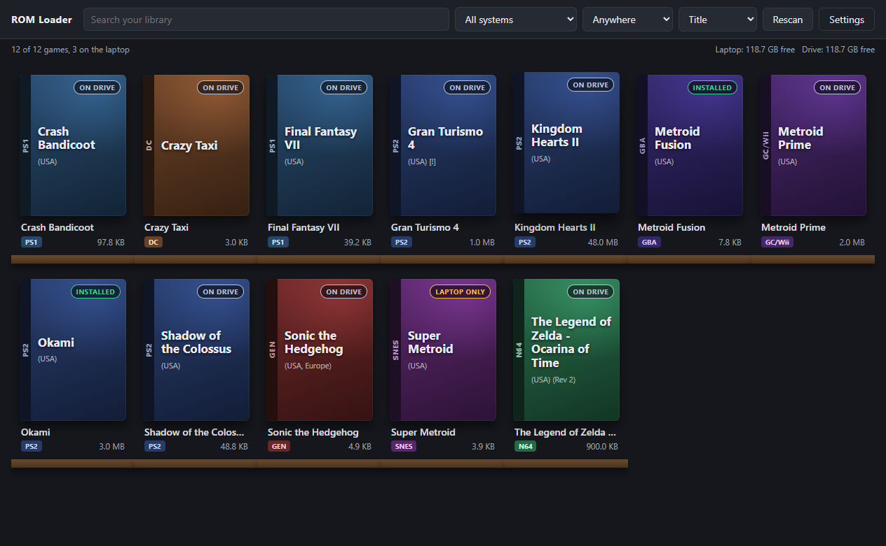
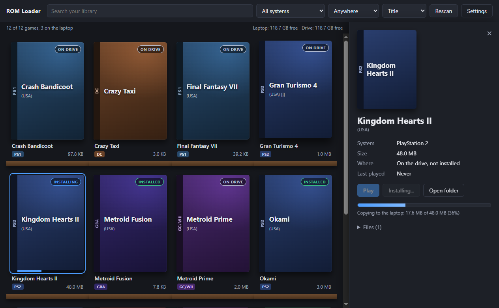

# ROM Loader

A Steam-style shelf for your games. They live on the external drive; **Install** copies one to the
laptop, **Uninstall** deletes the laptop copy (the drive is never touched), **Play** opens it in the
emulator you picked for that system.

## How to run it

1. Install **Node.js** (the LTS one) from https://nodejs.org.
2. In this folder, open a terminal and run `npm install`.
3. Run `npm start`.
4. Open **Settings**: pick the external drive folder and a laptop folder for installed games, then
   set the emulator program (the `.exe`) for each system you play. Leave the rest blank.
5. Press **Save and rescan** (or **Rescan** on the top bar any time you add games).

Games are found in folders named after the system, at the top of each folder:
`PS2`, `PS1` (or `PSX`), `GC` / `GameCube` / `Wii`, `N64`, `SNES`, `Genesis`, `GBA`, `NDS`, `Dreamcast`.
Subfolders inside those are fine. A `.cue` with its `.bin` tracks, an `.m3u` over several discs, or a
`.gdi` with its tracks shows up as one game.

## Good to know

- Your settings and the library list live in the app's data folder
  (`%APPDATA%\rom-loader\` on Windows): `config.json` (safe to edit by hand) and `library.json`.
- If the drive is unplugged, games that are only on the drive go grey; installed games still play.
- Uninstall sends the laptop copy to the Recycle Bin by default. Empty the bin to get the space back,
  or untick that box in Settings to delete straight away.
- The argument box next to each emulator uses `{rom}` for the game file. The defaults are
  `-batch "{rom}"` for PCSX2 and DuckStation and `-b -e "{rom}"` for Dolphin; RetroArch wants
  something like `-L "C:\path\to\core.dll" "{rom}"`.
- `npm test` runs the checks against a fake drive in a temp folder; nothing real is copied,
  deleted, or launched.

## Box art, later

v0 draws a placeholder box for every game. The art job is a separate step that reads `library.json`:
each game there already has a `hash` (a fingerprint of the file), a `cleanTitle` with the region
tags stripped ("Gran Turismo 4", not "Gran Turismo 4 (USA) [!]"), and its `system`. The job looks
the clean title up in the free [libretro-thumbnails](https://github.com/libretro-thumbnails) sets,
which are organised by system ("Sony - PlayStation 2/Named_Boxarts/..."), and saves the picture as
`art/<hash>.png` in the app's data folder; the app shows it on the next Rescan with no other change.
When a game has no match there, SteamGridDB (free account, API key) is the upgrade: bigger,
nicer covers and a search that tolerates messier titles.
